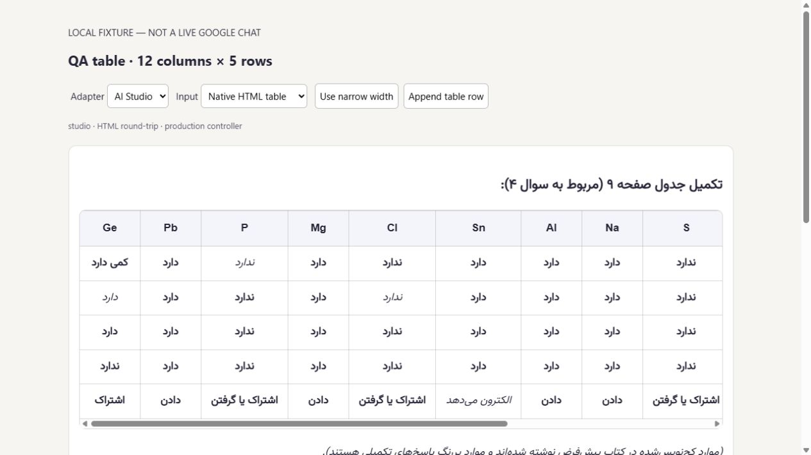

# Parsify

**Persian Markdown, readable mathematics, and code that stays in the right direction.**

[](LICENSE)
[](https://github.com/GoyimUser/Parsify/releases)
[](https://github.com/GoyimUser/Parsify/actions/workflows/ci.yml)
[](https://tauri.app/)
[](extension/)

Parsify is a local-first Persian Markdown reader and AI-chat enhancement toolkit. A shared AST-based renderer powers Windows, Android, and Chrome integrations for Google Gemini and Google AI Studio. RTL prose, isolated LTR math, and programming code each keep their own typography.

> **Early public release:** Windows packages are unsigned; the Android ARM64 package uses a development signing certificate. Final native PDF verification remains incomplete. See [validation and known limitations](docs/VALIDATION.md) before relying on printed output.

## Targets

| Target | Capabilities | Distribution |
| :--- | :--- | :--- |
| Windows | Local Markdown, live editor/preview, reader mode, native WebView2 printing | x64 NSIS installer |
| Android | Touch-friendly viewer/editor, paper size/orientation/margin controls, native printing | Android 7+ ARM64 APK |
| Chrome | Streaming response enhancement, original/enhanced views, per-site settings | Manifest V3 unpacked ZIP, Chrome 120+ |

The extension has **no PDF export**. Native app titles and identifiers retain **Persian Markdown Viewer** for compatibility with existing local installs. Repository release **v0.1.1** contains the extension hotfix (component **1.1.2**). Windows and Android installers remain at **v0.1.0**; their PDF implementations and fonts are unchanged.

## Features

- **Persian-first typography:** RTL prose/headings/lists; Persian digit conversion in prose; normalization of Hamza-above-Heh, including `معادلهٔ`.
- **Math syntax preservation:** dollar delimiters, `\(...\)`, `\[...\]`, supported arrays/matrices/aligned environments, display-sized operators, context-aware implication, and isolated LTR formulas.
- **Reliable numeric typography:** punctuation-adjacent digits (`1.8`, `7/9`, `|6|`) convert in rendered math nodes, not raw LaTeX commands. The bundled Yas face keeps its hollow zero and independent math-digit styling.
- **Persian text in equations:** B Nazanin when locally installed, with bundled Vazirmatn fallback. Proprietary B Nazanin and IRANSans binaries are not distributed.
- **Responsive tables:** GFM structure, inline math/emphasis, left/center/right Markdown colon alignment, and accessible horizontal scrolling without widening the page.
- **Clean print layout:** scrollbars, editor, toolbar and notifications are excluded; tables fit printable width, repeat headers and paginate. Landscape is recommended for dense tables.
- **IDE-style code:** C++, Python, JavaScript, TypeScript, HTML, CSS, Bash, JSON, Rust, Go, Markdown and more; Mac-style frames, labels and syntax colors. Containers stay LTR; Persian comments/strings are isolated. Inline code is preserved separately.
- **Independent font settings:** Persian prose, English prose (Arial / Times New Roman), in-math text, and code. Ubuntu Mono is bundled; Fira Code, JetBrains Mono, Cascadia Code, Source Code Pro, Courier New and system monospace can be selected with local-font fallback. Ligatures are optional and require a supporting font.
- **Local preferences:** light/dark themes, persistent settings, instant editor preview, and filesystem watching where supported.

## Install the release



*Local synthetic fixture, not a private or live Google chat; the table is scrolled to its leftmost columns.*

Download the [latest Chrome extension](https://github.com/GoyimUser/Parsify/releases/tag/v0.1.1) or the [Windows/Android packages](https://github.com/GoyimUser/Parsify/releases/tag/v0.1.0), together with the corresponding `SHA256SUMS.txt`. Verify checksums using `Get-FileHash <file> -Algorithm SHA256` on Windows or `sha256sum <file>` on Linux.

### Windows

1. Download `Parsify-v0.1.0-windows-x64-setup.exe` and verify its checksum.
2. Run the installer yourself. It is not Authenticode-signed; follow your device or organization's security policy.
3. Open **Persian Markdown Viewer**, choose **باز کردن**, and select a Markdown file or use the editor.
4. Choose **خروجی PDF**, select **Save as PDF** in the native dialog, and check the preview and paper settings before saving.

Microsoft Edge WebView2 is required. If absent, its initial installation may require internet access. Document rendering and bundled fonts work locally.

### Android

1. Download `Parsify-v0.1.0-android-arm64-dev-signed.apk` for an ARM64 Android 7+ phone.
2. Verify its checksum, then install through Android's normal package installer if you trust the release.
3. Open a local document. **خروجی PDF** opens mobile page settings followed by Android's print service; select **Save as PDF**, not a physical printer.
4. Developers with an authorized USB-debugging device may use `adb install -r <apk>`.

This is a **development-signed sideload build**, not a Play Store production release. Updating in place requires the same signing certificate. Preserve data before considering an uninstall. Local viewing/PDF rendering does not require a Parsify server or internet connection.

### Chrome extension

1. Extract `Parsify-v0.1.1-chrome-extension.zip` into a permanent folder.
2. Open `chrome://extensions`, enable **Developer mode**, select **Load unpacked**, and choose the folder containing `manifest.json`.
3. Refresh Gemini / AI Studio tabs. Use the Parsify popup or options page to enable sites and customize fonts, code theme and ligatures.
4. Use the original/enhanced toggle when needed. Disabling enhancements restores original content.

No Chrome Web Store listing is claimed. Google services require internet access and regional availability; Parsify does not bypass restrictions or change DNS.

## Repository layout

```text
extension/       Manifest V3 adapters, observer, settings and fixtures
src/             Shared React UI, AST renderer, typography and print CSS
src-tauri/       Rust shell and canonical Android Gradle project
android/         Android packaging tools and guidance
docs/            Architecture, build instructions, privacy and validation
public/          Bundled Yas font and third-party notices
qa/              Reproducible local table/math/PDF fixtures
scripts/         Dependency-notice tooling
.github/         Continuous integration
```

Android's native sources intentionally stay at Tauri's canonical `src-tauri/gen/android` path; `android/` provides the packaging entry point without a duplicate Gradle project. Build artifacts and private captures are not source-controlled.

## Build from source

Use Node.js 22 LTS, pnpm 10.15.1 and stable Rust, plus native platform prerequisites in [BUILDING.md](docs/BUILDING.md).

```sh
git clone https://github.com/GoyimUser/Parsify.git
cd Parsify
pnpm install --frozen-lockfile
pnpm test
pnpm build
pnpm tauri dev
# Extension:
pnpm extension:build
```

[Architecture](docs/ARCHITECTURE.md) · [Privacy](docs/PRIVACY.md) · [Contributing](CONTRIBUTING.md) · [Validation](docs/VALIDATION.md)

Original code is [MIT licensed](LICENSE). Bundled dependencies and fonts retain their own licenses; see [THIRD_PARTY_NOTICES.md](THIRD_PARTY_NOTICES.md).

## Technical reference

Local Tauri 2 + React Markdown reader/editor for Persian documents.

## Start

```powershell
pnpm install
pnpm tauri dev
```

## Code typography

Fenced Python, JavaScript, TypeScript, HTML, CSS, Bash/Shell, JSON, Rust, Go, Markdown and other common languages now share dark syntax-highlighted Mac-style frames alongside C++. Code remains LTR with isolated Persian comments/strings; inline code and math fonts are unchanged. Font Settings adds a code-only font selector (Ubuntu Mono by default) and a Font Ligatures toggle, persisted locally. Ubuntu Mono is bundled; other choices use installed fonts with fallback. The extension exposes the same controls and stores them in Chrome local storage.

## Renderer architecture

- `src/lib/markdown.ts`: unified/remark/rehype pipeline. GFM tables are parsed structurally; prose text nodes get Persian digit conversion while `math`, `inlineMath`, and code nodes do not. Inline-math pipes are shielded before table parsing and restored inside math AST nodes. Raw `$$ … $$` blocks are canonicalized as flow math without rewriting their LaTeX bodies, so arrays retain `\\`, `&`, and column specifications such as `{|c|c|c|}`. Bare display environments (arrays, matrices, and align variants) are promoted into block-math nodes.
- Display formulas receive KaTeX display mode through remark-math's `math-display` AST class, an explicit `dir="ltr"` wrapper, and centered LTR CSS. Inline math remains inline.
- KaTeX runs on the unchanged LaTeX AST values. A final HAST step converts only rendered KaTeX digit nodes, wrapping them in the bundled Yas math-digit font for a hollow Persian zero.
- `src/lib/tauri.ts`: native file picker, local file reads, filesystem watching, and the Windows WebView2 print entry point. Android uses its separate WebView print bridge; neither platform flattens the document to a screenshot.
- B Nazanin is requested first wherever a licensed local copy is available. It is not redistributed. Vazirmatn is bundled as the legal, offline Persian fallback for Android and other devices that do not provide B Nazanin. Yas is bundled under its upstream OFL license and used only for math digits.

## PDF

Use **خروجی PDF** and choose Save as PDF in the platform print dialog. Windows retains its existing WebView2 print path and native paper settings. Android's page modifier configures its native print attributes, with no Windows page-size changes.

Both platforms wait for document fonts/images before printing. Tables scroll horizontally only on screen; print CSS removes scrollbars and overlays, fits tables to the printable width, wraps cell text, repeats column headers, and allows long tables to continue across pages. Markdown column alignment, math, bold and italic cells are preserved. Landscape is recommended for especially dense tables on small paper.

Android validates paper/margin bounds (including zero margins), prevents concurrent jobs, reports preparation/start errors, and clears temporary print styles after the dialog closes or is cancelled. Closing the dialog is not reported as a successful file save.

Regression fixtures: `qa/native-tables.html` uses the production renderer/styles. With the local Vite server running, `qa/render-print-fixtures.ps1` generates Chromium reference PDFs for multiple paper sizes and Android-style layouts; `qa/check-print-fixtures.py` checks data, page bounds, text/vector output and absence of app overlays. These reference PDFs are not a substitute for Android device or Windows WebView2 end-to-end testing.

## Android

The same React renderer and Rust core compile to Android through Tauri 2. After installing an Android SDK, NDK, and the `aarch64-linux-android` Rust target, prepare local dependency paths and build an ARM64 APK:

```powershell
node android/prepare.mjs
pnpm tauri android build --apk --target aarch64
```

The resulting APK is written below `src-tauri\gen\android\app\build\outputs\apk`. On phones, the application defaults to reader mode, has touch-sized controls and a safe-area-aware toolbar, and opens Android's document save flow for PDF exports. Android uses the bundled Vazirmatn fallback for Persian prose plus the Yas math-digit font; B Nazanin is automatically preferred when a licensed device copy is available.
