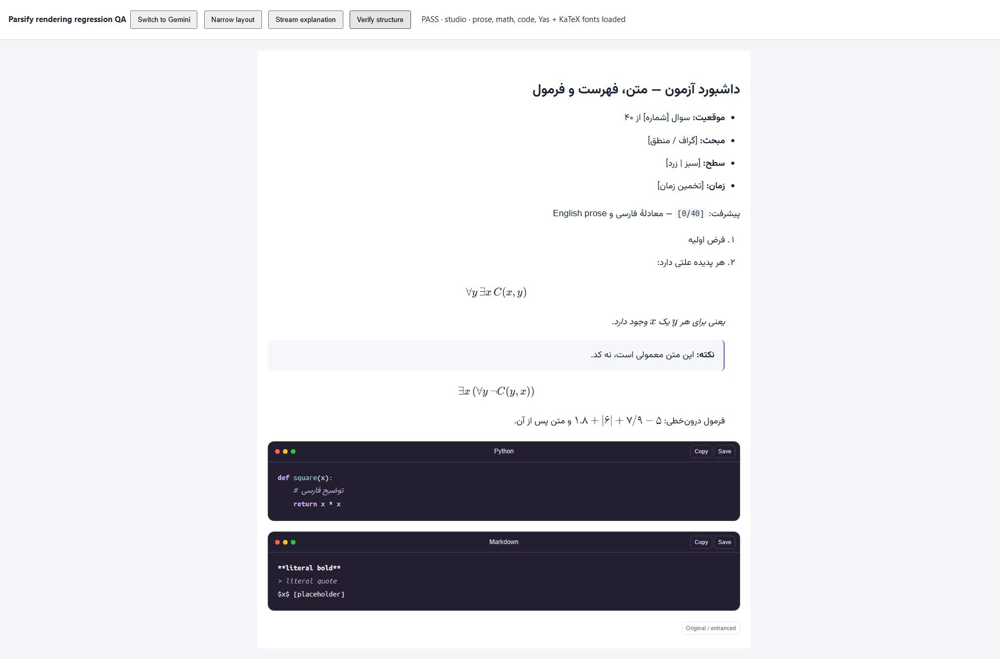
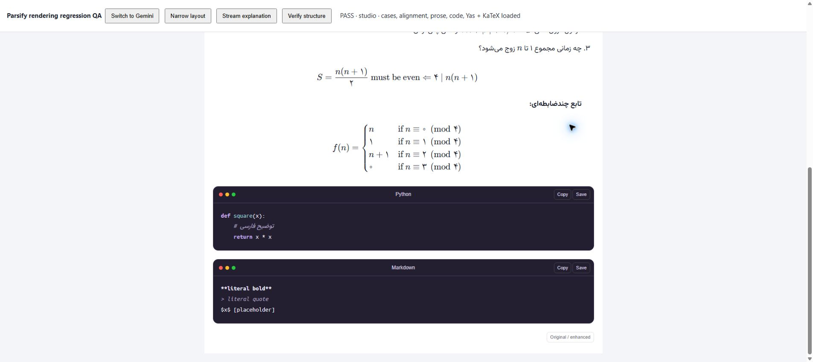

# Rich prose / math regression validation

Validated 2026-10-02–03. Repository release v0.1.1; extension component 1.1.2.

## Root causes

1. Turndown escapes literal prose brackets as Markdown. Running a second,
   permissive LaTeX-delimiter normalizer on that generated Markdown interpreted
   those escapes as display equations. Bracketed dashboard labels could swallow
   following list rows and expose raw Markdown in KaTeX errors.
2. On Gemini, expanding multiline math placeholders after list serialization,
   then stripping display-math indentation, detached equations from their list
   items. Indented explanatory paragraphs could become code AST nodes.
3. AI Studio can split a multiline formula across spans and BRs, leaving empty
   math components at its dollar-delimiter boundaries. Markdown rendering can
   also reduce double row separators to single trailing backslashes.

The fix establishes math boundaries before Markdown escaping and preserves
container indentation during serialization on both sites. Native Markdown input
uses its unchanged normalization path. Layout-only pre elements are unwrapped;
semantic code and explicit site code components remain literal.
Raw math is now recovered across contiguous inline DOM runs using exact DOM
ranges. Recognized complete environments are validated with KaTeX. Row repair
is limited to DOM-broken, ampersand-separated environment rows; valid annotated
TeX and code examples are not rewritten. Incomplete equations stay native.

## Automated checks

- 160 tests passed across ten suites, including 24 new cross-site regressions.
- The new suite initially reproduced five failures before the fix.
- Coverage includes ordinary bracketed labels, bold/italic prose, nested lists,
  quotes between display equations, raw dollar and LaTeX delimiters, adjacent
  inline equations, math in tables, literal Markdown code examples, layout-only
  pre wrappers and pending empty math.
- Multiline coverage includes four-row cases with damaged or intact delimiters,
  split inline/display math, preserved valid annotated row separators, literal
  code/prose mentions and incomplete-stream fallback.
- Existing sanitization, streaming, tables, fonts, code highlighting/direction
  and native renderer/PDF-helper tests remain passing.
- Extension TypeScript compilation, extension production bundling, native
  frontend TypeScript compilation and Vite production bundling passed.

## Visual checks

Chrome was used interactively on the synthetic
`/extension/regression-preview.html` fixture:

- Gemini and AI Studio adapters: dashboard brackets, emphasis, list structure
  and equations remained rich text; only the two genuine code samples received
  Mac-style frames.
- AI Studio narrow layout (360px content width), including a streamed explanation:
  prose brackets stayed literal and inline math rendered after completion.
- Both adapters reported successful structural checks and successful loading
  of Yas Math Digits, KaTeX Main and KaTeX Math font faces.
- Both adapters passed browser geometry checks for centered display equations
  within their available list column and explicit LTR direction. Oversized
  equations remain horizontally scrollable at 360px, without reordering math.
- The four-row piecewise expression rendered with its brace, all conditions,
  Persian digits and hollow zeros; original inline variables retained KaTeX.
- Full-page screenshots were inspected. No false code boxes or raw math errors
  appeared in prose. The deliberately literal Markdown code example stayed code.

This is a local synthetic fixture, not a private Google conversation.

## Font preservation

No production font files, font settings, math font rules or PDF styles were changed.
Extension-only CSS now makes inline math an isolated LTR box and gives display
math a centered, full-width scroll container.
The bundled Yas file retains SHA-256:

`d1a0a9dc482ed83222733158f7639959a03de057e223ee6743c25de66c678de2`

The fixture loads the same document-level font stylesheet as the extension,
and explicitly verifies font loading rather than only computed font-family names.

## Live-site scope and limitations

The broken dashboard was visually reproduced in the user's existing AI Studio
chat and its source DOM inspected before the fix. Source bracketed labels were
ordinary prose, not math. On October 3, the raw cases block was also reproduced
and its split spans, BRs and empty math boundaries inspected in the live chat.
Private chat content/screenshots are not published.

The updated production package has **not** been reloaded and certified in the
user's live Google tabs. Browser controls did not permit opening Chrome's
extension management page. The completed post-fix visual checks use the production
controller/extractor/renderer on local site-shaped fixtures. Future Google markup
changes and closed shadow roots remain limitations.

No Windows or Android installer rebuild or native PDF certification is claimed
for this extension-only hotfix. See [existing native validation limitations](VALIDATION.md).
